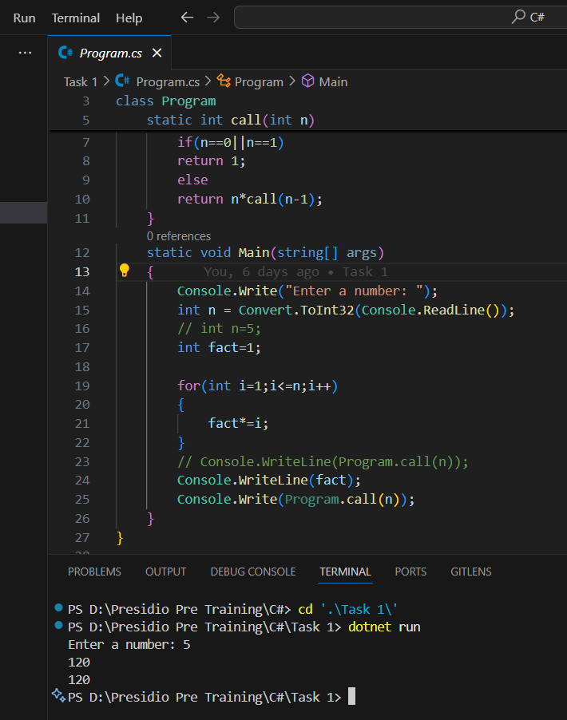

# Task 1 **Basic Data Types, Control Structures, and MethodsObjective:Requirements**

Output

Key Outcomes 

- The program calculates the factorial of a number using both an iterative approach (using a `for` loop) and a recursive approach (using the `call` method).
- The `call` method demonstrates recursion by calling itself until the base case (`n == 0 || n == 1`) is reached.
- The iterative approach calculates the factorial by multiplying numbers from 1 to `n` in a loop.
- The program takes user input for the number `n` and prints both the iterative and recursive factorial results.