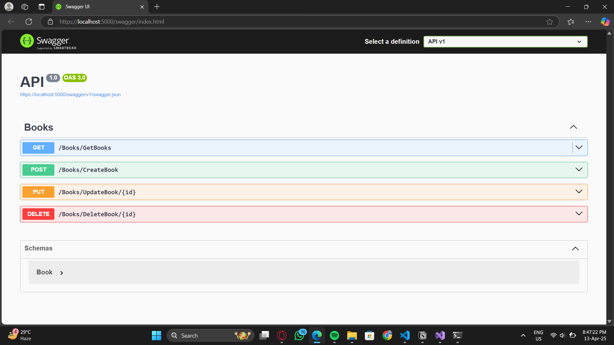
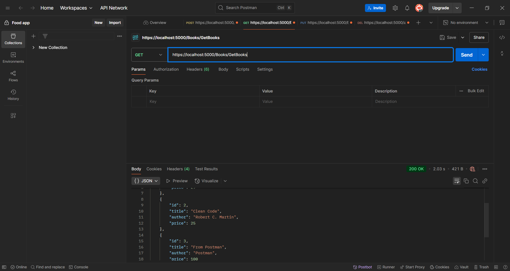
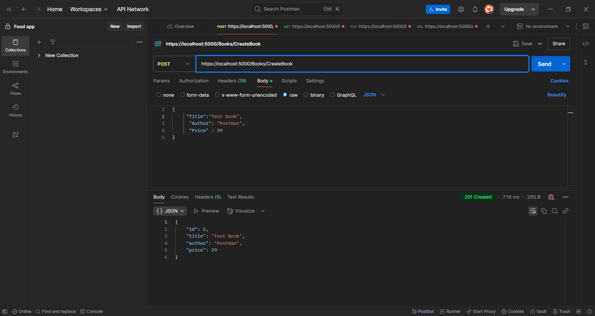
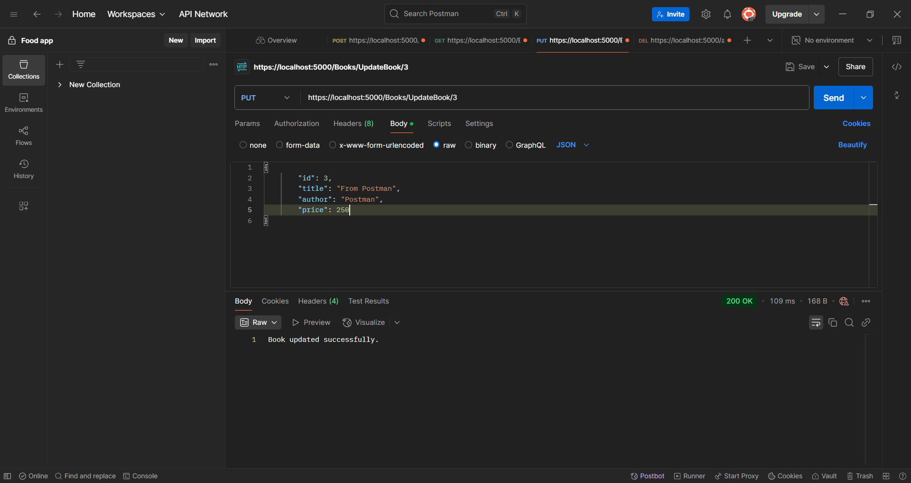
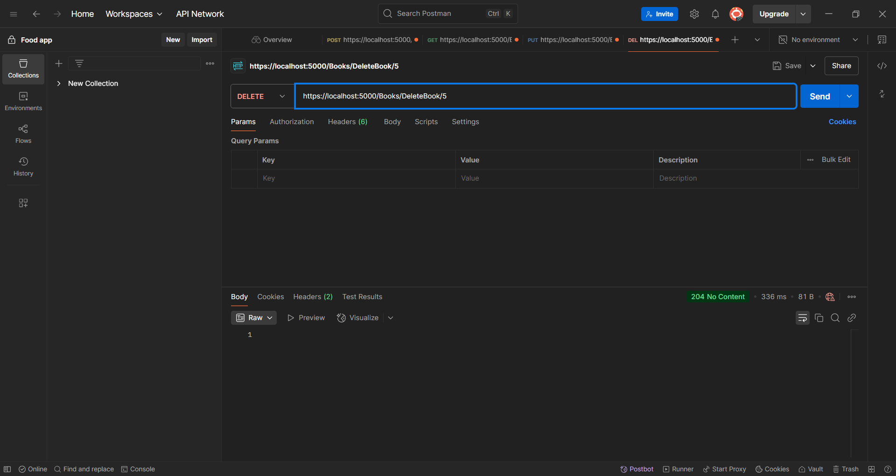
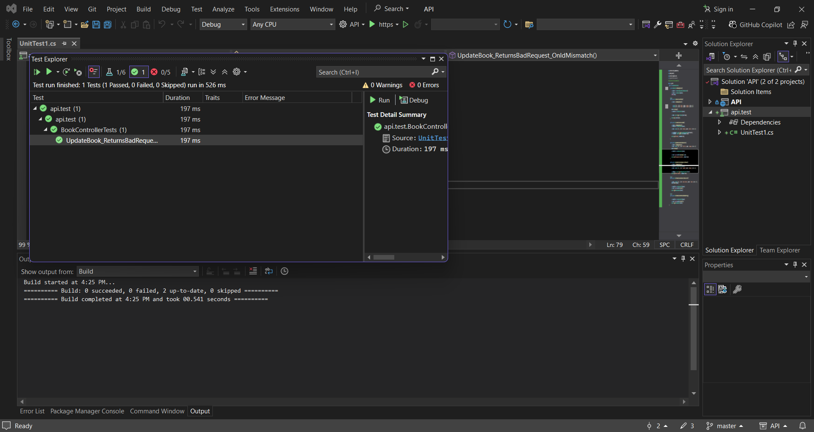

# Task 10: Building a Mini Microservice with ASP.NET Core

## Objective
Build a mini microservice using ASP.NET Core to demonstrate CRUD operations, database integration, and RESTful API design.

---

## Requirements

### Output

#### Swagger

#### CRUD Operations

  
  

#### Test

---

## Key Outcomes

### 1. **Implemented CRUD Operations**
- Created endpoints for Create, Read, Update, and Delete operations on books.
- Used `HttpGet`, `HttpPost`, `HttpPut`, and `HttpDelete` attributes for routing.

### 2. **Database Integration**
- Utilized Entity Framework Core for database interactions.
- Leveraged migrations to efficiently manage and apply database schema changes.

### 3. **Error Handling**
- Added error handling for database update exceptions and concurrency issues.
- Returned appropriate HTTP status codes for different scenarios (e.g., `BadRequest`, `NotFound`, `NoContent`).

### 4. **Asynchronous Programming**
- Used `async` and `await` for non-blocking database operations.

### 5. **RESTful API Design**
- Followed REST principles for designing API endpoints.
- Used meaningful route names like `GetBooks`, `CreateBook`, `UpdateBook`, and `DeleteBook`.

---

## Additional Information
The schema is defined in `Book.cs`.
