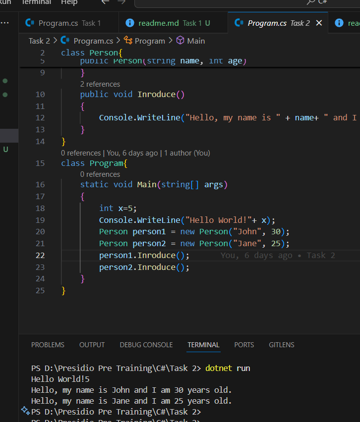

# Task 2 Simple Object-Oriented Programming (OOP)Objective:Requirements:

## Key Outcomes

- **Learned** how to define and use classes in C#.
- **Practiced** creating constructors to initialize object properties.
- **Implemented** methods within a class to perform specific actions.
- **Demonstrated** object instantiation and method invocation in the `Main` method.