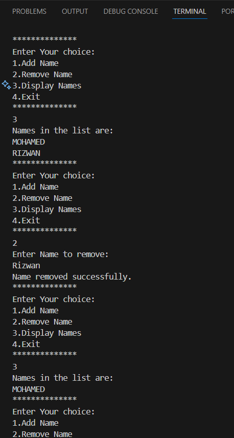

# Task 3: Basic Collections and String Manipulation

## Output

## Key Outcomes
- Understand the use of `List<T>` for managing collections in C#.
- Perform basic operations like adding, removing, and displaying elements in a list.
- Implement user input handling and validation in a console application.
- Gain familiarity with string manipulation using methods like `ToUpper()` for case-insensitive operations.
- Handle edge cases, such as invalid input or non-existent elements in a list.