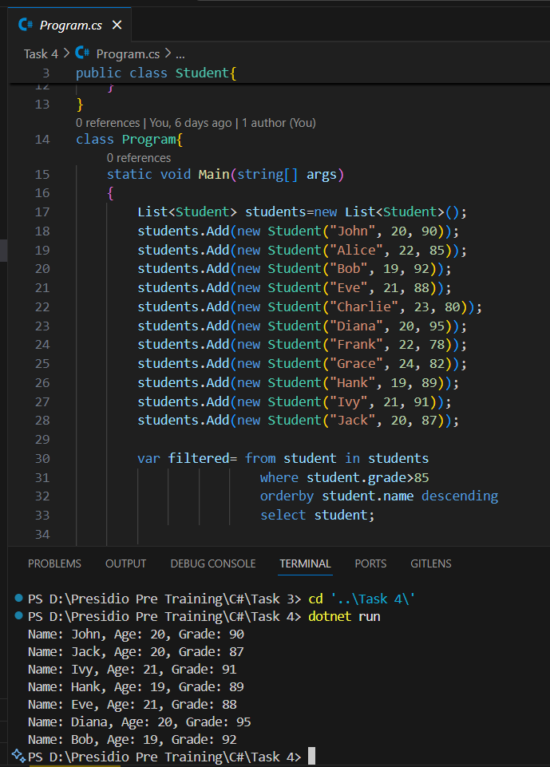

# Task 4: Working with Collections and LINQ

## Output

## Key Outcomes
1. **Create and Manipulate Collections**: Learned how to create and manage collections of custom objects in C#.
2. **Utilize LINQ Queries**: Gained experience in using LINQ to filter, sort, and select data from collections.
3. **Iterate and Display Results**: Practiced iterating over filtered results and displaying formatted output in the console.