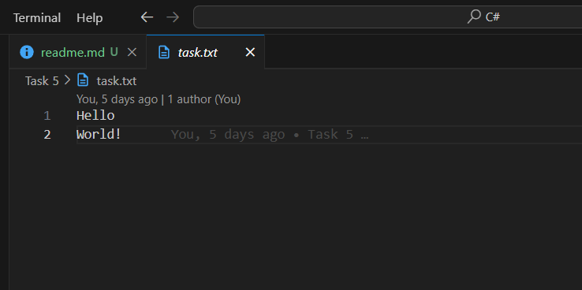

# Task 5 File I/O and Exception HandlingObjective:Requirements:

## Input

## Output
  

## Key Outcomes
1. **File Operations**: Demonstrates how to handle file operations, including reading and writing files in C#.
2. **Error Handling**: Implements error handling for common exceptions like `FileNotFoundException` and `IOException`.
3. **Text Analysis**: Counts the number of lines and words in a text file using efficient string manipulation techniques.
4. **Data Processing**: Writes the processed data (line and word counts) to an output file with proper exception handling.7