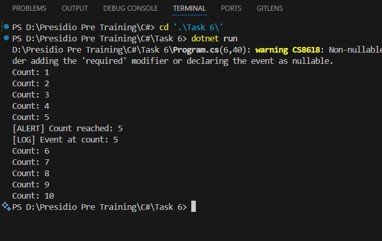

# Task 6: Delegates, Events, and Basic Event Handling

## Objective
Understand and implement delegates, events, and basic event handling in C#.

## Requirements
- Learn the concept of delegates and their role as method pointers in C#.
- Understand how to declare and use events to notify subscribers when specific conditions are met.
- Implement event handling by attaching multiple methods to a single event.
- Gain practical experience with incrementing counters and triggering events based on thresholds.

## Output

## Key Outcomes
- A delegate is a pointer to a method.
- Delegates and events enable flexible and reusable code.
- Events provide a mechanism for communication between objects.
- Practical implementation of event handling enhances understanding of C# concepts.
