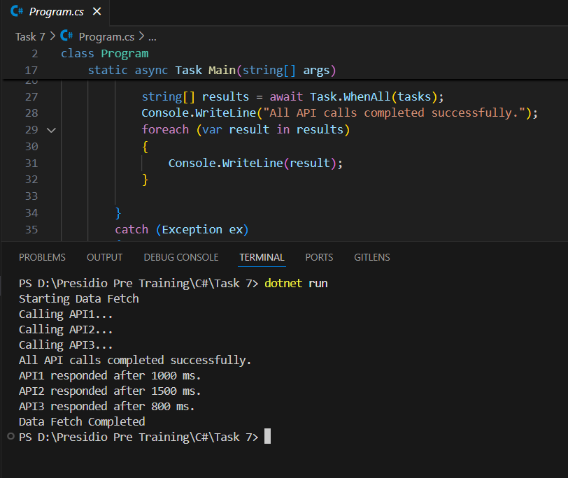

# Task 7: Asynchronous Programming and Multi-threading

## Objective
Learn and demonstrate the concepts of asynchronous programming and multi-threading in C#.

## Output

## Key Outcomes
1. **Asynchronous Programming**: Demonstrated the use of `async` and `await` keywords in C# to handle asynchronous operations effectively.
2. **Multi-threading**: Implemented multi-threading by executing multiple API calls concurrently using `Task.WhenAll`.
3. **Error Handling**: Showcased robust error handling in asynchronous methods using `try-catch` blocks.
4. **Simulating Delays**: Illustrated the use of `Task.Delay` to simulate API response delays and manage asynchronous workflows efficiently.