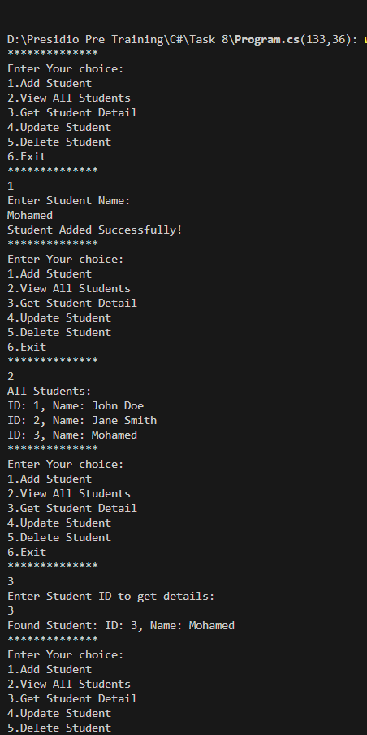
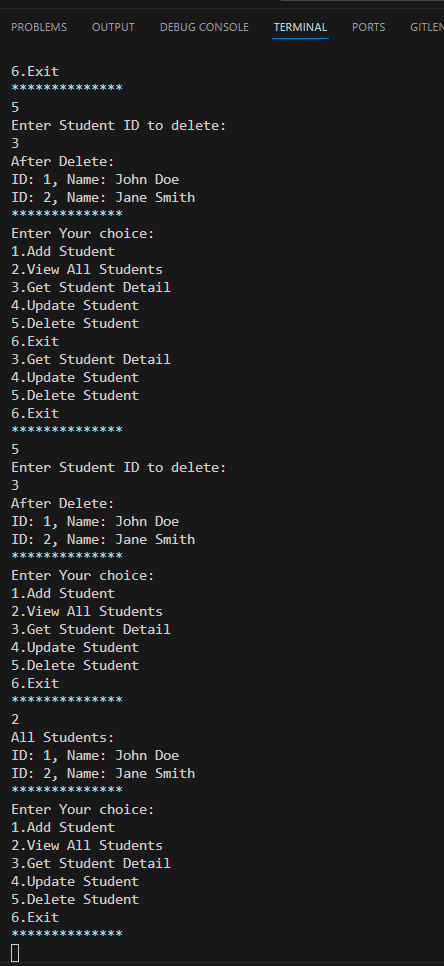

# Task 8: Generics and Interfaces with a Repository Pattern

## Objective
Learn and implement the repository pattern using generics and interfaces.

## Output

## Key Outcomes
1. **Generic Repository Pattern**: Implemented a reusable repository pattern using interfaces to manage CRUD operations for entities.
2. **Type-Safe Logic**: Utilized generics to create reusable and type-safe data management logic.
3. **Console Application**: Built a console-based application to manage student records with options for:
    - Adding students
    - Viewing students
    - Updating students
    - Deleting students
4. **Modular Code**: Demonstrated the practical application of interfaces and generics to achieve modular, maintainable, and scalable code.