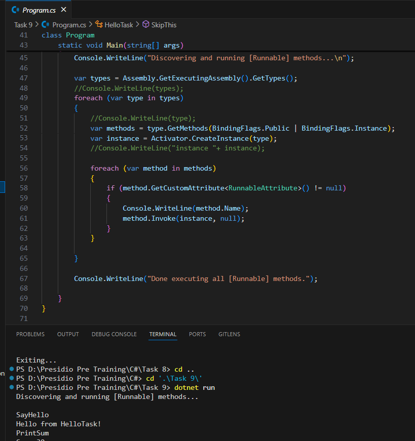

# Task 9: Reflection and Custom Attributes

### Output

### Key Highlights

1. **Custom Attributes**: Demonstrated the use of custom attributes in C# to mark specific methods for execution.
2. **Reflection**: Implemented reflection to dynamically discover and invoke methods marked with the `[Runnable]` attribute.
3. **Method Filtering**: Showcased the ability to filter and execute only the desired methods while skipping others.
4. **Real-World Application**: Highlighted the practical application of attributes and reflection for dynamic method invocation in real-world scenarios.
